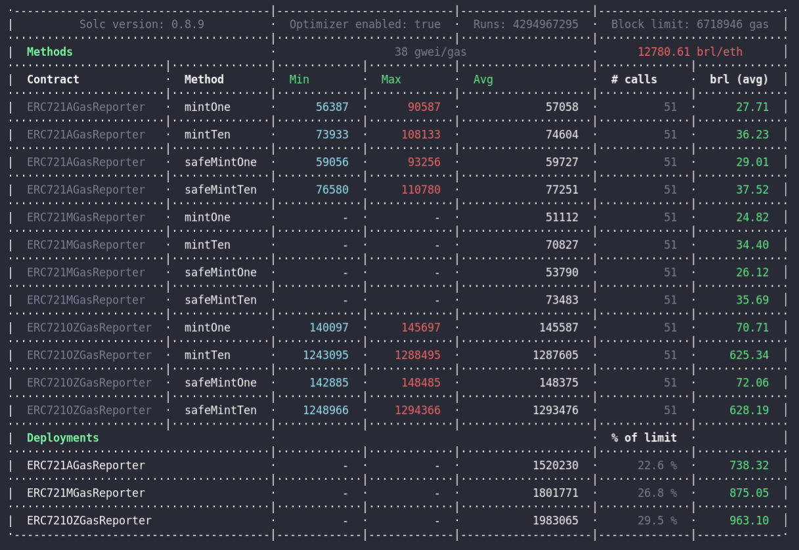
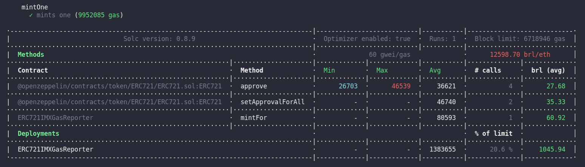

# Multiple NFT Implementations Gas Cost Comparison

```ts
//  ▒█████   ███▄ ▄███▓ ███▄    █ ▓█████   ██████
// ▒██▒  ██▒▓██▒▀█▀ ██▒ ██ ▀█   █ ▓█   ▀ ▒██    ▒
// ▒██░  ██▒▓██    ▓██░▓██  ▀█ ██▒▒███   ░ ▓██▄
// ▒██   ██░▒██    ▒██ ▓██▒  ▐▌██▒▒▓█  ▄   ▒   ██▒
// ░ ████▓▒░▒██▒   ░██▒▒██░   ▓██░░▒████▒▒██████▒▒
// ░ ▒░▒░▒░ ░ ▒░   ░  ░░ ▒░   ▒ ▒ ░░ ▒░ ░▒ ▒▓▒ ▒ ░
//   ░ ▒ ▒░ ░  ░      ░░ ░░   ░ ▒░ ░ ░  ░░ ░▒  ░ ░
// ░ ░ ░ ▒  ░      ░      ░   ░ ░    ░   ░  ░  ░
//     ░ ░         ░  Omnes     ░    ░  ░      ░
```

### Gas report testing conducted with Open Zeppelin, ERC721A, ERC721M and Immutable X NFT implementations on Polygon, BSC and Ethereum Mainnet forks for cost comparison purposes.

<br>

Project enabled by the following:

- [solidity-template](https://github.com/paulrberg/solidity-template): Paul Berg's Hardhat GitHub template;
- [hardhat-gas-reporter](https://github.com/cgewecke/hardhat-gas-reporter): Gas reporter plugin for hardhat;
- [hardhat-dodoc](https://github.com/primitivefinance/primitive-dodoc): PrimitiveFinance's Hardhat plugin to generate documentation for Solidity contracts;
- [open-zeppelin](https://github.com/OpenZeppelin/openzeppelin-contracts): OpenZeppelin contract library for secure smart contract development;
- [solmate](https://github.com/Rari-Capital/solmate): Rari Capital's gas optimized implementations for smart contract development;
- [erc721a](https://www.erc721a.org/): Chiru Labs' improved implementation of the ERC721/IERC721 standard;
- [erc721m](https://www.mingoes.io/erc721m): Mingoes' highly efficient implementation of the ERC721 standard inspired by ERC721A and solmate's ERC721;
- [immutable-x](https://github.com/immutable/imx-contracts): Ethereum Layer 2 for NFTs, with zero gas transactions, powered by Starknet.

---

<br>
<br>

## Observations and Findings

<br>

### Open Zeppelin, ERC721A and ERC721M 

Gas-wise, Open Zeppelin implementation costs the most, both referring to deployment and function calls. An notable observation would be that the ERC721M deployment cost is higher than the ERC721A one despite scoring lower gas costs in its function calls. ERC721A scored a praiseworthy gas perfomance and ERC721M still is the most gas efficient implementation even with a deployment cost slightly higher than ERC721A.

<br>

  **The absolute gas values scored are the following**: 

| **Open Zeppelin ERC721 Gas Usage** 	| **ERC721A Gas Usage** 	| **ERC721M Gas Usage** 	|
|---	|---	|---	|
| ✓ runs mintOne 50 times (7279250 gas) 	| ✓ runs mintOne 50 times (2853550 gas) 	| ✓ runs mintOne 50 times (2555600 gas) 	|
| ✓ runs safeMintOne 50 times (7418650 gas) 	| ✓ runs safeMintOne 50 times (2987000 gas) 	| ✓ runs safeMintOne 50 times (2689500 gas) 	|
| ✓ runs mintTen 50 times (64379350 gas) 	| ✓ runs mintTen 50 times (3730850 gas) 	| ✓ runs mintTen 50 times (3541350 gas) 	|
| ✓ runs safeMintTen 50 times (64672900 gas) 	| ✓ runs safeMintTen 50 times (3863200 gas) 	| ✓ runs safeMintTen 50 times (3674150 gas) 	|

<br>

Since our expectations of usage about these layer 1 contracts are that they will extensively called after deployment,  we've set the compiler optimizer runs to its maximum value, which seeks to maximize function call cost reduction, at the expense of increasing deployment costs. `ERC721OZGasReporter.test.ts`, `ERC721AGasReporter.test.ts` and `ERC721MGasReporter.test.ts` each test 50 times both the public and safe mint methods of all contracts; methods are batched 2 manners: in singular NFT mint per call and in 10 NFT mint per call.

 

### Immutable X

Only 1 NFT contract is minted on `ERC721IMXGasReporter.test.ts` due to the fact that further minting is intended to be held on layer 2 infrastructure for gasless transactions. In that regard, we've set the compiler optimizer runs to 1, which conducts the minimum amount of runs for further function call cost reduction, decreasing deployment costs.

 

The average price for deploying and minting a single layer 2 compatible NFT floats around the price of 50 mintOne function calls on layer 1 NFT contracts. As aforementioned, said price is to be compensated with layer 2 gasless transactions.

---

<br>
<br>

## Usage

### Pre Requisites

- [Node (v16 LTS)](https://nodejs.org/en/download/);
- [Yarn](https://classic.yarnpkg.com/en/docs/install/);
- [Git](https://git-scm.com/downloads).

<br>

### Setting the `.env` file

Before running any command, you need to create a `.env` file and set a 12 word BIP-39 compatible mnemonic, a Infura Ethereum API key and a Etherscan API key as environment variables. Follow the example in `.env.example`. If you don't already have a mnemonic, use this [website](https://iancoleman.io/bip39/) to generate one. You can get your API keys for Infura and Etherscan, respectively, [here][33] and [here][44].

<br>

### Install

Then, proceed with installing dependencies:

```sh
$ yarn install
```

### Compile

And compile the smart contracts with Hardhat:

```sh
$ yarn compile
```

---

<br>
<br>

### Setting necessary config options

#### Change `token` and `gasPriceApi` values in gas reporter `config.js` file, located at the following dev dependencies path:

```
/node_modules/eth-gas-reporter/lib/config.js
```

```js
class Config {
  constructor(options = {}) {
    this.token = options.token || "ETH";
    this.currency = options.currency || "brl";
    this.gasPriceApi =
      options.gasPriceApi ||
      "https://api.etherscan.io/api?module=proxy&action=eth_gasPrice";
    this.coinmarketcap =
      options.coinmarketcap || "{INSERT_API_KEY}";
```

#### You can get your own `coinmarketcap` API key [here][55] and change `{INSERT_API_KEY}` for it .

<br>


- #### `token` and `gasPriceApi` options:

| Network            | token | gasPriceApi                                                      |
| ------------------ | ----- | ---------------------------------------------------------------- |
| Ethereum (default) | ETH   | https://api.etherscan.io/api?module=proxy&action=eth_gasPrice    |
| Binance            | BNB   | https://api.bscscan.com/api?module=proxy&action=eth_gasPrice     |
| Polygon            | MATIC | https://api.polygonscan.com/api?module=proxy&action=eth_gasPrice |

* Should be set to Ethereum for Immutable X contracts testing. 
---

<br>
<br>

### Fork

Run a local node forked from a Mainnet network by providing and endpoint url to the `--fork` flag in a terminal

```sh
$ yarn hardhat node --fork "{INSERT_MAINNET_ENDPOINT}"
```

| Network            | {INSERT_MAINNET_ENDPOINT}                             |
| ------------------ | ----------------------------------------------------- |
| Ethereum (default) | https://mainnet.infura.io/v3/{INFURA_MAINNET_API_KEY} |
| Binance            | https://bsc-dataseed.binance.org/                     |
| Polygon            | https://rpc-mumbai.maticvigil.com                     |

---

<br>
<br>

### **Gas test the Layer 1 NFTs**

In a separate terminal, run the gas reporting tests against the already set local Mainnet fork:

```sh
$ yarn gastest
```

### **Gas test the Immutable X NFT**

In a terminal separate from the one being used for the hardhat node, run the gas reporting tests against the already set local Ethereum Mainnet fork:

```sh
$ yarn imxtest
```
**_NOTE:_**  Preferably, re-run your local Mainnet fork if testing right after running the layer 1 NFT tests.

---

<br>
<br>

### Clean

Delete the smart contract artifacts, the coverage reports and the Hardhat cache:

```sh
$ yarn clean
```

[33]: https://infura.io/pricing
[44]: https://etherscan.io/apis
[55]: https://coinmarketcap.com/api/pricing/